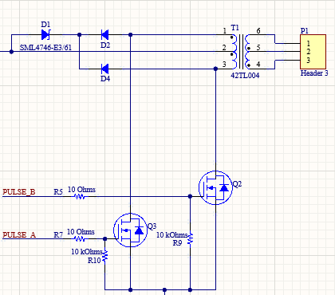
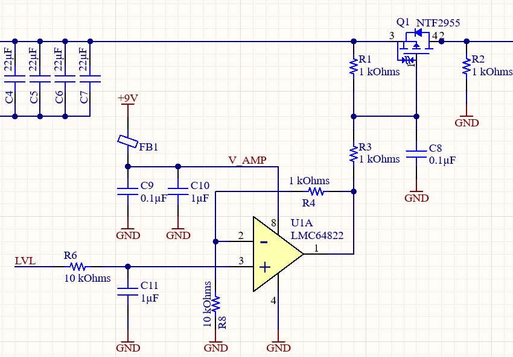

# WT-312, a MK-312 style driver on a stick!
## About:
This project aims to bring the hardware of e-stim/TENS to an easy-to-use module. Think: Sparkfun, Adafruit, DFRobot, etc.
I build this project with the main goal of interfacing to an ESP32 processor so many of the documentation or some design decissions will be made towards this processor. But you should be able to use your own favorite MCU.

This device tries to mimic the output stage of the well-known Erostec ET312 or better, the DIY reverse engineered MK-312. Hopefully by recreating this output stage, the same e-stim experience can be achieved as those devices.

## Current project status:
- ✅ Create V1.0 schematic+PCB
- ✅ V1.0 Testing and debugging 
- ✅ Commit V1.1 BOM patches
- ✅ Create V2.0 Schematic
- ✅ Route V2.0 PCB
- 🟧 Review process (ongoing)
- 🔲 Fix BOM with (available) alternative sources 
- 🔲 Order new batch of V2.0 PCBs

## Theory of operation:
### Output stage:

Just like the ET/MT312 this stick uses a 42TL004 audio transformer with the primary connected to the TENS output and the secondary connected to some circuitry to generate pulses.

These pulses are generated by the microcontroller, it can controll frequency (how many pulses per second) and the duration of each pulse.

A single "pulse"  consists of two steps:
1. Apply a voltage on A-signal. This will make one of both N-FETs conductive and current will start to flow through half the windings of the transformer.
2. Apply a voltage on the B-signal. This will make current flow through the other half of the transformer and reverse the polarity of the output TENS signal. Thus making this a bi-polar TENS driver.

To prevent the an excessive high drain-source voltage on the N-MOS drivers because of back-EMF generated by the transformer, two diodes will clamp this voltage to a zener diode on top of the centre-tap voltage.

### Level control:

The intensity of a TENS stimulus is not only defined by the duration and frequency of the pulses, but also by the ouput power of that pulse. To control the output power of a pulse, we can limit how much current is flowing into the primary side of the transfomer.

By controlling the gate-voltage of a P-FET it is possible to control how much current that P-FET will allow to flow. An opamp is used to boost the I/o-voltage of the microcontroller to the 9V needed on the P-FET gate.

Important is to note that the LVL signal is inverted, a 0V means the P-FET is allowing maximal current and a 3.3V/5V will mean the P-FET is turned off.

### Current feedback:
Because not all P-FET are created 100% equally, it is important to first characterize the transfer curve between the LVL-signal and the current flowing through the transformer. This curve can be measured by the MCU on a embedded or external 
ADC on the *I_FB* pin of the WT-312 module.

To keep the voltage lost over the shunt resistor to a minimum, a small value shunt resistor is used and then amplified to the full-range of the ADC by an opamp.

## What is new in V2.0:
### 1. PWM
The DAC inside the ESP32 or ESP8266 is not great. Also, not every MCU has a built-in DAC to let alone 2, 3 or 4 DAC channels. However MCU's can generate pretty good resolution PWM signals and since the LVL signal does not require high bandwith, the V2.0 module has a R-C filter on the LVL signal so a PWM signal can be used instead of an analog DAC.
### 2. Improved clamping circuit
The clamping diodes in V1.0 ate into the power of the output. So they were removed in the patch. In V2.0 the clamping circuit is revised to let the voltage rise to a couple volts *above* the 9V input voltage. This should keep protecting the N-MOS but not impair the ouput power.
### 3. Bulk capacitance
Generating high-power pulses takes ... well ... power. These small 9V battery blocks have quite some internal resistance and are not able to generate the currents required for high-power TENS play. Not only batteries are bad a delivering pulses of several amps, also these ubiquitous chinese DCDC boost converter modules fail to deliver.

2 large electrolytic caps + a bunch of high value MLCC's will make sure that high current pulses to the primary can be delivered. The elco's can be mount sideways on the module to save some height.
### 4. LEDs
In this new design the REF pin is not used anymore. To keep compatibility between the V1.0 and V2.0 footprint the same number of pins was kept. This pin is now connected to a LED on the board. This LED is 100% optional and does not have to be stuffed, the footprint can be left empty.

## NodeMCU32s example (V1.0):
This is an example on how to connect the WT-312 module to the ESP32. This configuration will work with the provided example firmware.

## Licence:
All hardware design, software, images and documentation are licenced under the Creative Commons licence.
